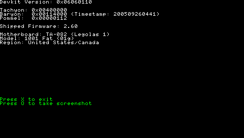

# psp-detect
A tool to display information about the PSP (PlayStation Portable)

I wanted a tool that wasn't as complex as pspident so I wrote this. It displays basic information about the PSP's motherboard as well as perhipherals like Baryon version.

A pre-built binary is located in the [DETECT](DETECT) folder. Runs on all custom firmwares except 3.60/3.7x as they have patched NIDS. Also runs on 1.00/1.50 using the load device patches.

